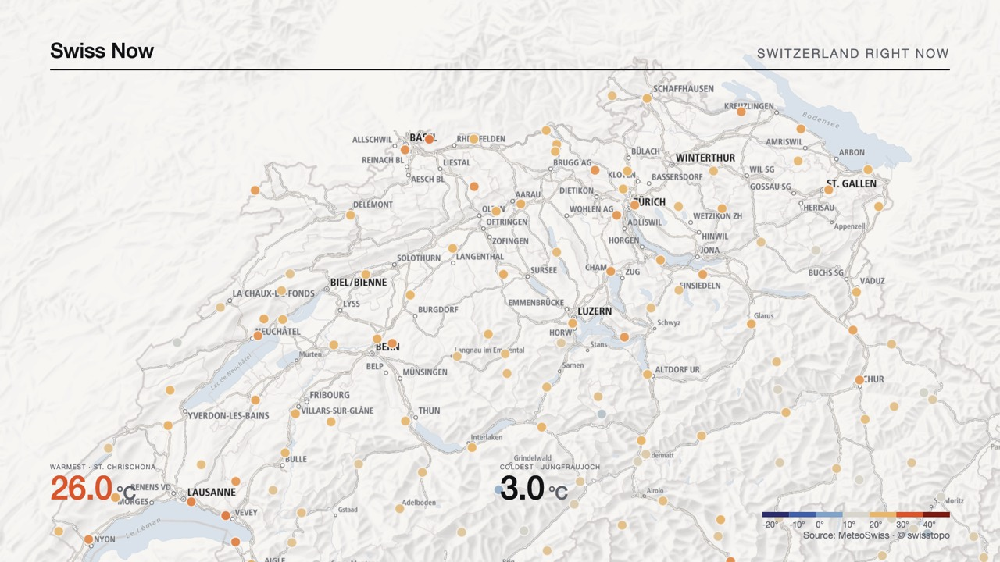

# Swiss Now — Spikes

> Technical spikes from Phase 0 with results and decisions. Each spike is a small, disposable experiment whose outcome is recorded here and, where it changes a decision, in the other docs.

## Spike A — MapLibre GL + swisstopo style + live temperature layer (2026-09-07)

**Question.** Can the forked swisstopo vector style and a live MeteoSwiss station layer run smoothly in MapLibre GL inside the Next.js app, and should the MVP use MapLibre 5.24 or 6.7?

**Setup.** `apps/web` production build (`next build`, Turbopack), MapLibre GL **6.7.0**, style `/map/swiss-now-light.json` (forked `ch.swisstopo.lightbasemap.vt`), GeoJSON source of 299 stations with a `circle` layer coloured by the shared temperature scale and a `symbol` layer with rounded values from zoom 8, hover card, visibility-aware 5-minute poller, opt-in FPS meter (`?fps=1`).

**Results.**

| Check                                      | Result                                                                                                                                                                                                                                                                                                                                                                                                                  |
| ------------------------------------------ | ----------------------------------------------------------------------------------------------------------------------------------------------------------------------------------------------------------------------------------------------------------------------------------------------------------------------------------------------------------------------------------------------------------------------- |
| deck.gl 9.4 `@deck.gl/maplibre` peer range | `^4.5.1 \|\| ^5.0.0 \|\| ^6.0.0` → v6 is supported by the planned layer engine                                                                                                                                                                                                                                                                                                                                          |
| Style, tiles, glyphs, sprites              | load from swisstopo with `© swisstopo` attribution; 4–7 vector tiles for the national view                                                                                                                                                                                                                                                                                                                              |
| WebGL2 context                             | created; MapLibre 6 requires WebGL2                                                                                                                                                                                                                                                                                                                                                                                     |
| Web worker under Turbopack                 | **failed initially**: MapLibre 6 spawns a module worker via `import.meta.url`, which Turbopack resolved to the page URL, so the worker fetched HTML ("non-JavaScript MIME type"). **Fix:** copy `maplibre-gl-worker.mjs` + `maplibre-gl-shared.mjs` to `public/map/vendor/` on `predev`/`prebuild` and call `setWorkerUrl("/map/vendor/maplibre-gl-worker.mjs")`. Verified: worker and shared chunk load, tiles arrive. |
| No-WebGL2 environments                     | **failed initially**: MapLibre threw inside a client effect and Next's error boundary replaced the page. **Fix:** probe `webgl2` first and render an honest "Map unavailable" notice while the HUD stays live. Verified headless (gstack Chromium has no WebGL2).                                                                                                                                                       |
| Frame rate (desktop / phone)               | **not measured in this session**: the in-app browser pane stayed hidden (`document.hidden = true`, no `requestAnimationFrame`) and the headless browser has no GPU. Measure manually: run `pnpm --filter @swiss-now/web dev`, open `http://localhost:3000/?fps=1`, pan and zoom, read the meter on a laptop and a phone. Target ≥ 60 fps desktop, ≥ 30 fps mid-range phone.                                             |
| Bundle                                     | `maplibre-gl` ~580 KB minified ESM + 19 KB worker + 490 KB shared chunk, loaded once and cached                                                                                                                                                                                                                                                                                                                         |

**Decision.** **MapLibre GL 6.7** for the MVP. Rationale: deck.gl supports it, the app is greenfield (ESM-only and WebGL2 are not constraints in 2026 browsers), and the two integration issues found have clean fixes that are now in the codebase. Re-evaluate only if the phone check falls below 30 fps with the station layer; the laptop holds 60 fps.

**Follow-ups.** Manual FPS measurement (above); hand-tune the forked style after looking at it on a real screen (the fork is a scripted first pass); replace the ad-hoc poller with TanStack Query when a second layer arrives (Phase 1).

## Spike B — Remotion fixed-plate render of the same style (2026-09-07)

**Question.** Does the shared design system (forked swisstopo style, tokens, scales, `Metric` primitive) render correctly in the Remotion target, using the official maps-skill technique, on the free licence and a laptop?

**Setup.** `apps/video`, Remotion 4.0.522, MapLibre GL 6.7 (same version as the web app), composition `SwissNowPlateSpike` 1920×1080 @ 30 fps, 90 frames. Map rendered once as a **fixed plate** (3840×2160, static renderer camera at the route's maximum zoom, centred on the route's midpoint) and moved per frame with CSS `translate` + `scale` from `interpolateCamera(START, END, easeHouse(t))`; zoom delta capped at 1.0 so the CSS scale never exceeds 1. Station circles from a saved `/api/state/weather` fixture coloured by `maplibreColorExpression("temp", "temperature")` (moved into `@swiss-now/motion` so web and video share it). HUD: `Metric` primitive with frame-driven `progress`, legend from `legendTicks("temperature")`, attribution line. `remotion.config.ts`: `--gl=angle`, concurrency 1, JPEG frames. MapLibre worker copied to `public/map/vendor/` and set via `setWorkerUrl(staticFile(...))`, same workaround as the web app.

**Results.**

| Check                                                                                        | Result                                                                                                                                     |
| -------------------------------------------------------------------------------------------- | ------------------------------------------------------------------------------------------------------------------------------------------ |
| Bundling workspace TS sources (`@swiss-now/core`, `@swiss-now/motion`) in Remotion's webpack | works without configuration                                                                                                                |
| Style, tiles, glyphs from swisstopo in headless Chrome                                       | load; attribution rendered in the frame                                                                                                    |
| Worker                                                                                       | loads from the static copy; no `import.meta.url` issue surfaced under webpack, but the static path keeps both targets identical            |
| Render time                                                                                  | **90 frames in 19 s** (~4.7 frames/s) on an Apple-silicon laptop with `--gl=angle`, concurrency 1; MP4 5.6 MB                              |
| Frames 5 and 60 (see `docs/spikes/`)                                                         | national view → corridor glide; circles, metrics and legend match the website's tokens exactly; no shimmer on the basemap during the glide |
| Licence                                                                                      | local render, individual use → Remotion free licence                                                                                       |

**Decision.** The architecture holds: one style JSON, one token set, one scale definition, one primitive library, two renderers. Remotion stays local-only for the MVP; a 30–45 s story at this throughput renders in ~3–4 minutes on a laptop, well inside the free GitHub Actions or Vercel Sandbox budgets if automation is wanted later.

**Follow-ups (design pass, Phase 1).** The forked style is still label-heavy (every town at zoom 8) and the hillshade is strong for a "quiet" ground; hand-tune `fork-basemap-style.mjs` (hide `place_other` below zoom 9, lower hillshade opacity further). The 10–30 °C band of the temperature scale reads almost uniformly orange on a warm day; add a stop around 15 °C. Both changes propagate to web and video automatically.
